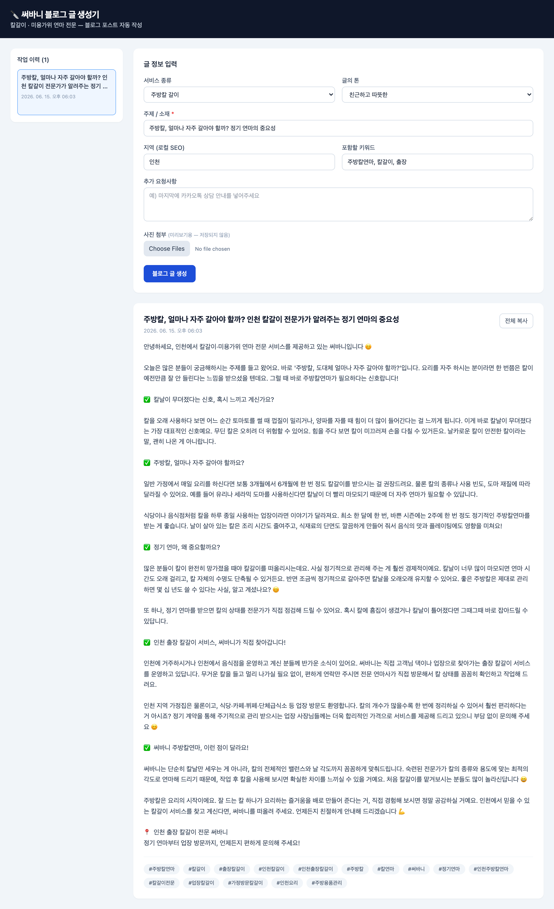

# 써바니 블로그 글 생성기

칼갈이 · 미용가위 연마 전문 업체 **써바니** 의 블로그 글을 Claude API 로 자동 생성하는 웹앱입니다.

- **프론트엔드:** Vite + React + TypeScript + Tailwind CSS
- **백엔드:** Express 프록시 (API 키 보호 + CORS 우회)
- **모델:** `claude-sonnet-4-6`
- **저장소:** https://github.com/huawei19761028-stack/surbani-blog

## 화면



> 좌측 작업 이력 · 가운데 입력 폼 · 하단 생성 결과(제목·본문·태그).

## 클론

```bash
git clone https://github.com/huawei19761028-stack/surbani-blog.git
cd surbani-blog
```

## 구조

```
.
├── server.js          # Express 프록시 (포트 3001) — Anthropic API 중계
├── vite.config.ts     # /api → localhost:3001 프록시 설정
├── src/
│   ├── App.tsx        # 메인 UI / 폼 / 생성 로직 / 작업 이력
│   ├── main.tsx
│   └── index.css      # Tailwind
├── .env.example       # API 키 템플릿
└── package.json
```

브라우저는 `api.anthropic.com` 을 직접 호출하지 않습니다. 프론트는 `/api/generate`
로 요청하고, Express 서버가 `.env` 의 키를 붙여 Anthropic 으로 중계합니다.
덕분에 **API 키가 브라우저에 노출되지 않고 CORS 문제도 없습니다.**

## 실행 방법

### 1. 의존성 설치

```bash
npm install
```

### 2. 환경 변수 설정

`.env.example` 를 복사해 `.env` 를 만들고 실제 API 키를 넣으세요.

```bash
cp .env.example .env
```

```env
ANTHROPIC_API_KEY=sk-ant-여기에_실제_키
```

> `.env` 는 `.gitignore` 에 포함되어 커밋되지 않습니다.

### 3. 개발 서버 실행 (서버 + 프론트 동시)

```bash
npm run dev
```

`concurrently` 가 다음 두 개를 한 번에 띄웁니다.

- Express 프록시 → http://localhost:3001
- Vite 개발 서버 → http://localhost:5173

브라우저에서 **http://localhost:5173** 접속.

### 4. 프로덕션 빌드 (선택)

```bash
npm run build     # 타입체크 + 정적 빌드 → dist/
npm run preview   # 빌드 결과 미리보기 (이 경우 server.js 는 별도 실행 필요)
```

## 사용법

1. 서비스 종류 · 주제 · 지역 · 톤 · 키워드 등을 입력합니다. (`주제/소재` 는 필수)
2. **블로그 글 생성** 클릭 → 제목 · 본문 · 태그가 생성됩니다.
3. 생성된 글은 자동으로 **작업 이력(localStorage)** 에 저장됩니다.
4. 좌측 이력 목록에서 **다시 불러오기 / 삭제** 가능합니다.
5. **전체 복사** 버튼으로 제목+본문+태그를 클립보드에 복사합니다.

> 사진은 미리보기·생성 참고용으로만 쓰이며 **저장되지 않습니다.**

## 트러블슈팅

| 증상 | 원인 / 해결 |
| --- | --- |
| `ANTHROPIC_API_KEY 가 설정되지 않았습니다` | `.env` 파일과 키를 확인하고 `npm run dev` 재실행 |
| 401 / 인증 오류 | API 키가 유효한지, 결제(크레딧)가 활성화됐는지 확인 |
| `/api/generate` 404 | 프록시 서버(3001)가 떴는지 확인 (`npm run dev` 가 둘 다 띄움) |
